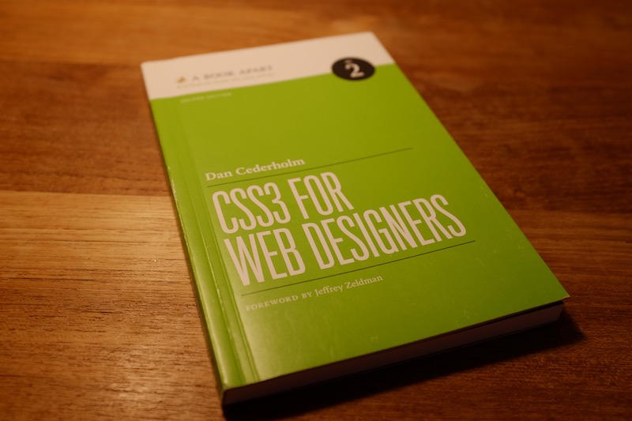

<a href="https://abookapart.com/products/css3-for-web-designers">CSS3 for Web Designers</a> was one of the first books I read when I started making websites at work about six years ago. Like its companion book <a href="https://abookapart.com/products/html5-for-web-designers">HTML5 for Web Designers</a> by Jeremy Keith, I was grateful to have a short, accessible primer on what were then emerging and messy web technologies. Essentially, the book says <em>here’s what you can use now</em>, and <em>here are some of the things on the horizon</em>. Nice.

Now six years later, both books have been revised to bring the content up to date. While I did not perform a side-by-side comparison (having passed along my first editions), I do not regret upgrading my copies one bit. I like the <a href="http://www.abookapart.com">A Book Apart</a> series because the titles serve equally well as introductions and refresher courses. Therefore, I count on them to be fairly evergreen (<cite>Design is a Job</cite>) or updated before they start to feel too stale. Unlike a reference manual, the ABA series titles can each be read in an hour or two, and so every page counts.

## But, I’m not a web designer

Especially given Cederholm’s contributions to the community (particularly Dribbble), I understand why this book is marketed to web designers who need to know what’s possible now and what’s likely to be possible in the future. But I think the scope of this book is perfect for developers who are just staring out (say, someone in a coding bootcamp or internship). Likewise, I think this is a great pick for college and grad school courses that have an intro to web design component. It doesn’t spend a lot of time defining what CSS is, but I think Cederholm is fair in his treatment of where CSS3 is today -- yeah, you’ll still need to include vendor prefixes, but things are getting better -- and there’s fun stuff you can be using right now.

## General Philosophy and Approach

This book rightly presents CSS3 as a presentation layer, and Cederholm opens the book by noting how we can use CSS3 to enhance websites without damaging the user experience for people running older browsers:

<blockquote>
When we decide to focus on and target these non-critical areas of the visual experience, it becomes incredibly freeing to layer on CSS3 and enrich the interaction of a website without worrying that the core message, layout, and accessibility will be hindered.
</blockquote>

So, hakuna matata. Likewise, Cederholm steers us away from trying to use CSS3 to handle page layouts. With flexbox now enjoying [broad support](http://caniuse.com/#feat=flexbox), it may be tempting to use it liberally. However, the upcoming Grid Layout is better equipped to handle page layouts, so the final chapter of the book encourages us to use the Flexible Box Layout Module for “micro layouts” -- say, a search bar or web form section of an existing site. (For a great preview of what’s possible with Grid Layout, I’ll refer you to Jen Simmons’ [Labs](http://labs.jensimmons.com) page.)

While some of these new tools were driven by browser makers themselves, Cederholm encourages us to use vendor prefixes (always before what’s in the working spec) to ensure a smooth transition. By adding an extra line or two of code, we increase our chances that people will be able to enjoy the effects we’re trying to achieve with CSS3.

## CSS3 Applications and Examples

One thing I love about all of Cederholm’s books is that he comes up with fantastic examples, some of which are built to illustrate core components of the book, others built by third parties on the web. A client is asking you to “jazz up the site for some WOW factor?” This book is packed with short examples of how to use CSS Transitions, pseudo classes like <code>hover:</code> states, and multiple backgrounds (aka parallax scrolling) to achieve some nice effects natively in the browser -- no JavaScript necessary. I would have liked to see additional examples of the parallax scrolling as it seems the Silverback / Clear Left example has changed since the publication of this book (maybe we’re tired of parallax already).

So, if you’re a bit rusty on CSS, this is a great book to pick up and add a few new tricks to your repertoire. I read about things that just two years ago I remember my dev team saying would not be possible without JavaScript.

## Must Websites Always Look the Same?

By positioning CSS3 as an enhancement layer, Cederholm argues we can -- should? -- use these emerging tools and techniques in websites we’re building today. But he warns us to watch out for “critical” components (taken from a discussion of styling an image gallery with CSS3 hover state):

<blockquote>
Users of Internet Explorer, for example, will just see a gallery of clickable thumbnails, and that’s perfectly OK. If the hover treatment were _critical_, then we’d need to rethink our use of CSS3 to achieve the visual experience.
</blockquote>

That is, even when adding vendor prefixes and polyfills, we may not be able to accommodate every browser and device, so it’s best to be conservative in anything beyond visual enhancements. To me, this is pretty squarely inline with the general aims of progressive enhancement. I’m not going to get every inside joke, but it never feels good to know I’m missing out on something. So be subtle.

Anyone who has walked a client through responsive web design has likely already had to talk about how sites will look different from browser to browser (and, depending on user preferences, person to person). Let’s face it: there are so many devices and use cases that I’m not sure a completely uniform look/feel is even desirable, let alone achievable. The best we can to is to try and accommodate as many people as possible, and for now that means using vendor prefixes and not breaking critical elements for the sake of some visual panache.

## Conclusion

I really liked this book. While it’s unlikely to serve as a reference, I could see myself re-reading this on a lunch break six months down the road -- perhaps something that didn’t catch my interest the first time will help me solve a problem without having to pull in a JavaScript library. It’s more likely that I will pass this to friends who are just starting to build websites, or maybe I’ll share it with a programmer who only occasionally does front-end work. As an introduction or refresher course, I believe this book will help a lot of people build better websites in a short amount of time. Recommended.
